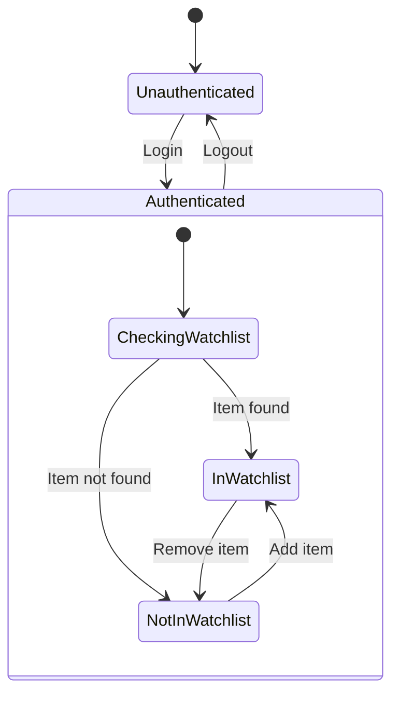
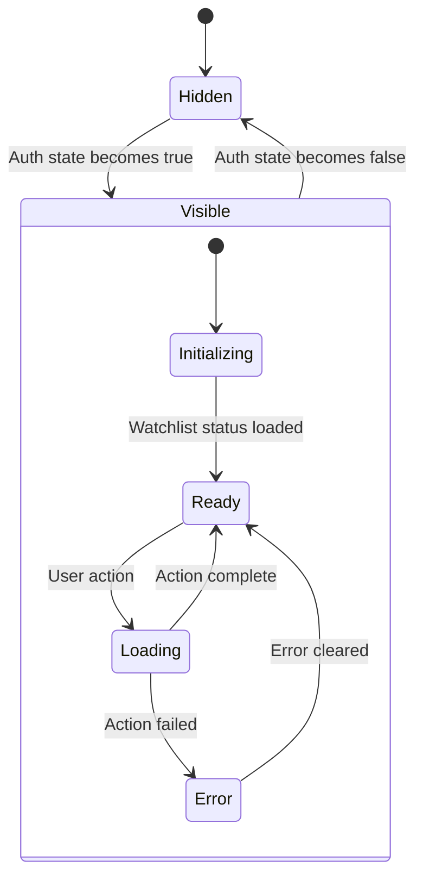

# Design Document

## Overview

The watchlist button component currently has a reactivity bug where it fails to appear when users transition from unauthenticated to authenticated state within the same session. This occurs because the component's conditional rendering logic (`{#if userStore.isAuthenticated}`) is not properly reactive to authentication state changes that happen after the component is initially mounted.

The core issue is that Svelte's reactivity system needs to be explicitly connected to the user store's authentication state changes, and the component needs to re-evaluate its visibility and internal state when authentication status changes.

## Architecture

### Current Architecture Problems

1. **Static Conditional Rendering**: The `{#if userStore.isAuthenticated}` block is evaluated once during component initialization and doesn't react to subsequent auth state changes
2. **Missing State Synchronization**: When auth state changes, the component doesn't re-initialize its watchlist status checking
3. **Lifecycle Mismatch**: The `onMount` hook only runs once, missing auth state changes that occur after mounting

### Proposed Architecture

1. **Reactive Authentication Tracking**: Use Svelte's `$derived` and `$effect` runes to create reactive connections to auth state
2. **Dynamic State Management**: Implement reactive state management that responds to auth changes
3. **Conditional Logic Refactoring**: Replace static conditional rendering with reactive visibility management

## Components and Interfaces

### WatchlistButton Component Modifications

#### Current Interface
```javascript
// Props
let { itemId, size = 'default', className = '' } = $props();

// State
let isInWatchlist = $state(false);
let loading = $state(false);
let error = $state(null);
```

#### Enhanced Interface
```javascript
// Props (unchanged)
let { itemId, size = 'default', className = '' } = $props();

// Reactive authentication state
const isAuthenticated = $derived(userStore.isAuthenticated);
const currentUser = $derived(userStore.user);

// Component visibility state
let shouldShow = $derived(isAuthenticated);

// Watchlist state (reset when auth changes)
let isInWatchlist = $state(false);
let loading = $state(false);
let error = $state(null);
```

### UserStore Integration

The user store already provides reactive authentication state through:
- `isAuthenticated = $derived(this.user != null)`
- Auth state change listener: `pb.authStore.onChange((auth) => { this.user = pb.authStore.model; })`

No changes needed to the user store interface.

## Data Models

### Authentication State Flow



### Component State Transitions



## Error Handling

### Authentication State Change Errors

1. **Watchlist Status Check Failure**: If checking watchlist status fails during auth state change, show error state but keep component visible
2. **Network Errors**: Handle network failures gracefully with retry mechanisms
3. **State Inconsistency**: Ensure component state is reset properly when auth state changes

### Error Recovery Strategies

1. **Graceful Degradation**: Show component in neutral state if watchlist status cannot be determined
2. **Retry Logic**: Implement automatic retry for failed watchlist operations
3. **User Feedback**: Provide clear error messages and recovery options

## Testing Strategy

### Unit Tests

1. **Authentication State Reactivity**
   - Test component visibility changes when `userStore.isAuthenticated` changes
   - Verify component re-initializes when user logs in
   - Confirm component hides when user logs out

2. **Watchlist State Management**
   - Test watchlist status checking on auth state change
   - Verify state reset when switching between users
   - Test error handling during state transitions

3. **User Interactions**
   - Test add/remove watchlist functionality after auth state change
   - Verify loading states during operations
   - Test error recovery scenarios

### Integration Tests

1. **Full Authentication Flow**
   - Test login → watchlist button appears → functionality works
   - Test logout → watchlist button disappears
   - Test user switching scenarios

2. **Cross-Component Communication**
   - Verify user store changes propagate to watchlist button
   - Test multiple watchlist buttons on same page react consistently

### Manual Testing Scenarios

1. **Session State Changes**
   - Navigate to item page while unauthenticated
   - Login from another tab/page
   - Verify watchlist button appears without refresh
   - Test watchlist functionality immediately after appearance

2. **Multiple Authentication Events**
   - Login, logout, login again in same session
   - Verify component behavior remains consistent
   - Test with different user accounts

## Implementation Approach

### Phase 1: Reactive State Management

1. Replace static conditional rendering with reactive visibility
2. Implement `$effect` to watch authentication state changes
3. Add state reset logic for auth transitions

### Phase 2: Enhanced Lifecycle Management

1. Implement reactive watchlist status checking
2. Add proper cleanup for state transitions
3. Enhance error handling for auth-related operations

### Phase 3: Testing and Validation

1. Implement comprehensive test suite
2. Perform cross-browser testing
3. Validate performance impact of reactive changes

## Performance Considerations

### Reactivity Optimization

1. **Minimal Re-renders**: Use `$derived` to minimize unnecessary component updates
2. **Efficient State Checks**: Cache watchlist status and only re-check on auth changes
3. **Cleanup Management**: Properly cleanup reactive subscriptions to prevent memory leaks

### Network Optimization

1. **Debounced Operations**: Prevent rapid-fire watchlist operations during auth transitions
2. **Cached Results**: Cache watchlist status per user session
3. **Error Boundaries**: Implement proper error boundaries to prevent cascading failures